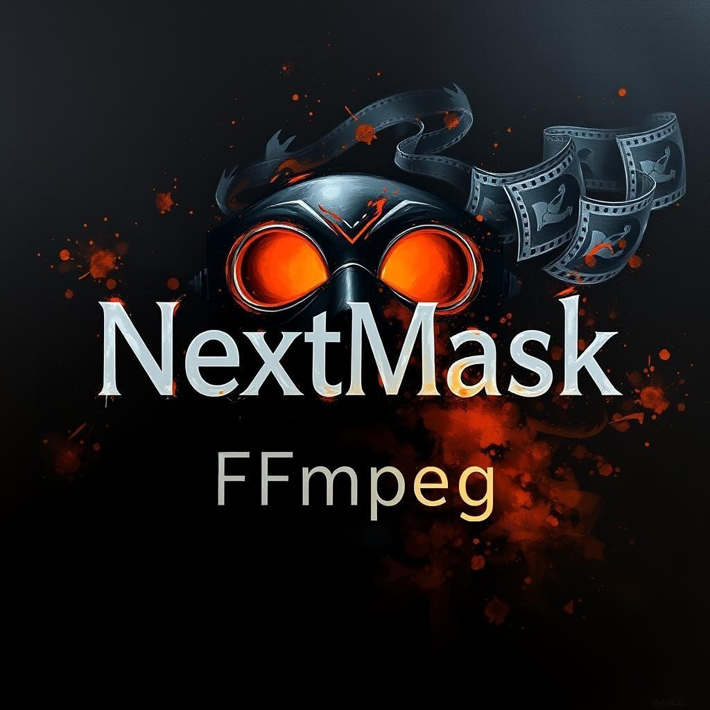
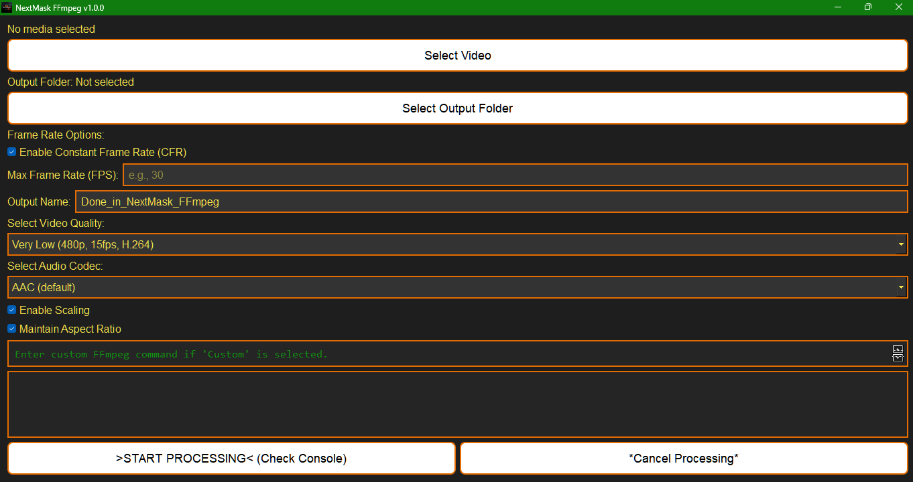

# NextMask FFmpeg
Developed by Iván Ayub

NextMask FFmpeg is a robust desktop application designed for multimedia professionals and enthusiasts. It leverages the FFmpeg library to enhance and process video files through an intuitive interface.

---

## Download
[Click here to download the EXE application from Google Drive (.zip)](https://drive.google.com/file/d/1wG2v_967fqO7PkLwb1LJcvjzEAegSIR2/view?usp=sharing)

For inquiries or feedback, contact me at: [sellocasadenubes@gmail.com](mailto:sellocasadenubes@gmail.com).

---

## Description
NextMask FFmpeg combines the power of FFmpeg with a user-friendly interface, allowing seamless multimedia quality enhancements and conversions. Its streamlined design makes it accessible to both professionals and casual users.

---

## Features
- **Video Processing:**
  - Presets for resolutions from 480p to 4K (AV1 Ultra).
  - Custom configuration options for advanced users.

- **Audio Processing:**
  - Supports multiple codecs, including AAC, MP3, and AC3.
  - Option to retain the original audio.

- **Customizable Output:**
  - Adjust file names, formats, and save locations.
  - Scale resolutions and maintain aspect ratios.

- **Real-Time Logging:**
  - Progress and detailed logs displayed during processing.

- **Modern Interface:**
  - Intuitive dark theme designed for efficient use.

---

## How to Use
1. **Select Multimedia File:** Choose the file to process using the "Select Video" button.
2. **Choose Output Folder:** Specify the destination folder for processed files.
3. **Configure Settings:**
   - Select video quality and audio codec.
   - Customize file name and format.
   - Adjust advanced settings like scaling and frame rates.
4. **Start Processing:** Click "Start Processing" to begin, and monitor real-time logs.
5. **Cancel if Needed:** Cancel processing at any time during the operation.

### Example Scenario
Enhance a low-resolution video to HD quality or convert it to a modern format for compatibility with newer devices, maintaining high audio fidelity.

---

## Application Structure
### User Interface (UI)
Built with PyQt5, the application offers a responsive and modern interface that simplifies multimedia processing.

### Core Modules
1. **Processing Engine:** Interfaces with FFmpeg for video and audio tasks.
2. **Logging Module:** Provides real-time feedback on process status.
3. **Configuration Manager:** Handles user preferences and custom settings.

---

## System Requirements
- **Operating System:** Windows 7 or later
- **Dependencies:**
  - Python 3.7 or later
  - PyQt5
  - FFmpeg (installed and added to the system PATH)

---

## Captures

---

## Development & Contribution
### Credits
This software uses [FFmpeg](https://ffmpeg.org/) as its core multimedia processing engine. FFmpeg is an industry-leading framework for multimedia content. Special thanks to the FFmpeg team for their invaluable contributions to open-source technology. FFmpeg is licensed under the [LGPLv2.1](https://ffmpeg.org/legal.html) or later.

Thanks to the developers of [PyQt5](https://pypi.org/project/PyQt5/) for enabling a feature-rich graphical interface.

In addition, the following Python libraries are used in this project:

- **os**: Standard library for interacting with the operating system.
- **sys**: Provides access to system-specific parameters and functions.
- **subprocess**: For running system commands from within the Python program.
- **base64**: Handles encoding and decoding of data in base64 format.
- **tempfile**: Used to create temporary files.
- **PyQt5.QtCore**: Provides core functionality like threading and signals.
- **PyQt5.QtGui**: Handles graphical elements, including icons.
- **PyQt5.QtWidgets**: Used for building the GUI, including buttons, labels, and dialogs.

### Contributions
We welcome contributions! To contribute:
1. Fork the repository.
2. Make your changes.
3. Submit a pull request.

---

Enjoy using NextMask FFmpeg! Your feedback is invaluable and helps us improve continuously.
